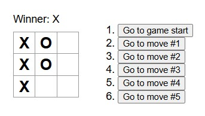

Modified app: https://asherkim815.github.io/tic-tac-toe-modified/

# Tic-Tac-Toe

## Modified Version Screenshots

## Original Version Screenshot

## About the App

Updated version of React documentation's tic-tac-toe tutorial.
- https://react.dev/learn/tutorial-tic-tac-toe

Adopted features the docs proposed as challenges:
1. For the current move only, show “You are at move #…” instead of a button.
2. Rewrite Board to use two loops to make the squares instead of hardcoding them.
3. Add a toggle button that lets you sort the moves in either ascending or descending order.
4. When someone wins, highlight the three squares that caused the win (and when no one wins, display a message about the result being a draw).
5. Display the location for each move in the format (row, col) in the move history list.
