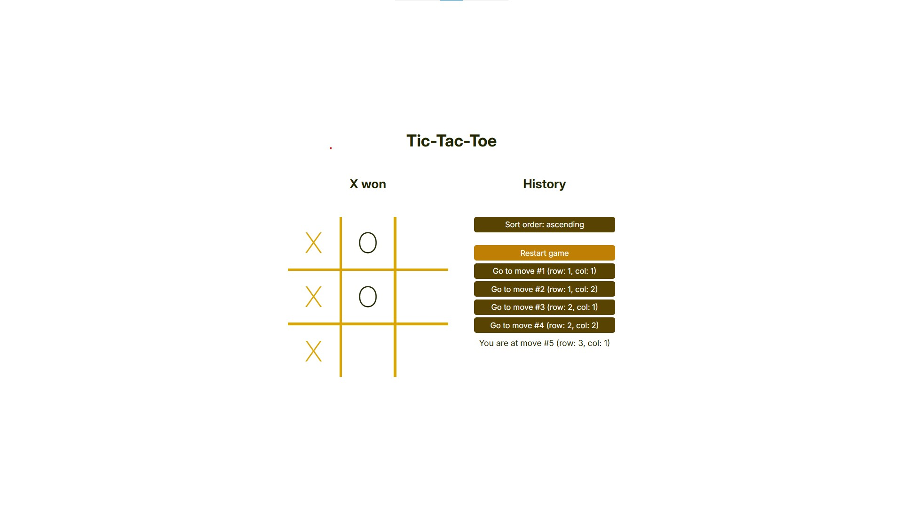
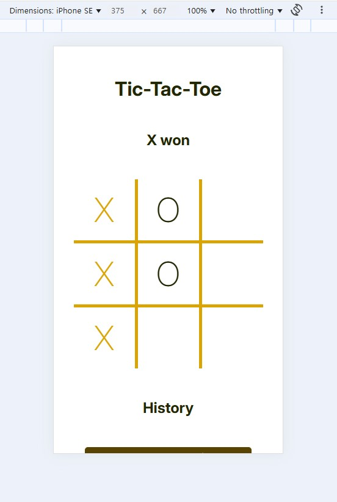
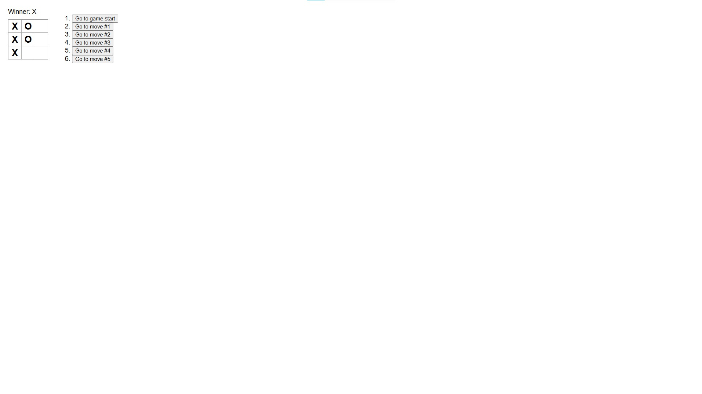
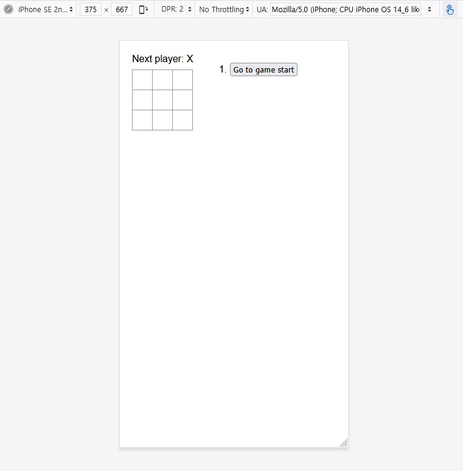

Deployed app link (배포된 앱 링크): https://asherkim815.github.io/tic-tac-toe-modified/

# Tic-Tac-Toe (틱택토)

## Modified Version Screenshots (수정 버전 스크린샷)

## Original Version Screenshot (기존 버전 스크린샷)

## About the App

This is an updated version of React documentation's tic-tac-toe tutorial (https://react.dev/learn/tutorial-tic-tac-toe).

Below are the challenges the docs proposed and how I met them:

1. For the current move only, show “You are at move #…” instead of a button.\
   ✔ In History.jsx, I made pastMoves return \
 instead of \<li> if (history[index] === currentMove).
   
2. Rewrite Board to use two loops to make the squares instead of hardcoding them.\
   ✔ I used one loop (map method) to make an array of the squares (yes, because I was lazy, but also because I wanted to use the array's index for the fifth challenge), and fit them in a 3x3 grid div (.board).   
3. Add a toggle button that lets you sort the moves in either ascending or descending order.\
   ✔ I made a state (sortOrder) and a function (reverseSortOrder()) that changes the state upon clicking the toggle button (i.e. to "descending" if sortOrder is "ascending", and vice versa). I then made History component reverse pastMoves (array containing all past moves) with reverse() method if the state is "descending".
4. When someone wins, highlight the three squares that caused the win (and when no one wins, display a message about the result being a draw).\
✔ Every time a move is made, decideWinner() function checks if there's a winner. If truthy, the function changes the three connected squares' font color to goldish (#d9a404). If falsy, the function changes all squares' font color to blackish (#222601). I could have used useRef with DOM, but I was lazy and wanted to save energy and time.
5. Display the location for each move in the format (row, col) in the move history list.\
✔ I made history (state) preserve another element (the clicked square's index, mentioned in the answer to the second challenge), and made History's pastMoves (the long-listed \<li>) show matching row and col. So history's initial state changed from [Array(9).fill(null)] to [[Array(9).fill(null), null]], which now contains the clicked square's index.

## 앱에 관하여
이 앱은 React 공식문서의 자습서: 틱택토 게임(https://react.dev/learn/tutorial-tic-tac-toe)의 최종 결과물을 개선한 버전입니다.

자습서 저자는 마지막에 다섯 개의 도전 과제를 제시했고, 저는 다음과 같이 해결했습니다.

1. 현재 이동에 대해서만 버튼 대신 “당신은 #번째 순서에 있습니다…”를 표시해 보세요.\
   ✔ History.jsx 컴포넌트 내, history[index]와 currentMove가 같은 숫자일 경우(history와 currentMove는 서로 다른 state) pastMoves가 \<li> 대신 \
를 반환하도록 했습니다.
   
2. Board를 하드 코딩 하는 대신 두 개의 루프를 사용하여 사각형을 만들도록 다시 작성해 보세요.\
   ✔ 하나의 루프(map 메서드) 사용 후 모든 사각형을 3x3 그리드(.board)에 넣었습니다. 다섯 번째 도전 과제에서 사각형의 인덱스를 사용하고 싶었기 때문입니다.
3. 동작을 오름차순 또는 내림차순으로 정렬할 수 있는 토글 버튼을 추가해 보세요.\
   ✔ sortOrder라는 state와 reverseSortOrder()라는 함수를 만든 후, 토글 버튼을 클릭하면 sortOrder가 바뀌도록 했습니다('오름차순'일 경우 '내림차순'으로, '내림차순'일 경우 '오름차순'으로). 그리고 sortOrder이 '내림차순'일 경우 reverse() 메서드를 통해 pastMoves(과거의 모든 수(moves)를 담은 배열)의 순서가 뒤바뀌도록 했습니다.
4. 누군가 승리하면 승리의 원인이 된 세 개의 사각형을 강조 표시해 보세요. (아무도 승리하지 않으면 무승부라는 메시지를 표시하세요.)\
   ✔ 아무 플레이어가 빈 사각형을 클릭할 때마다(re-render가 발생할 때마다) decideWinner() 함수가 승자가 생겼는지 확인합니다. 참 같은 값(truthy)이면 승부를 결정지은 세 사각형의 글꼴 색상을 금색(#d9a404)으로 변경합니다. 거짓 같은 값(falsy)이면 모든 사각형의 글꼴 색상을 검은색(#222601)으로 변경합니다. useRef와 DOM을 사용해 해결할 수도 있었지만, 에너지와 시간을 절약하고 싶었습니다.
5. 이동 히스토리 목록에서 각 이동의 위치를 형식(열, 행)으로 표시해 보세요.\
   ✔ history(state)가 클릭된 사각형의 인덱스를 기억하도록, 그리고 History(컴포넌트)의 pastMoves가 그 인덱스와 일치하는 열과 행을 표시하도록 했습니다. history의 초기 state를 [Array(9).fill(null)]에서 사각형의 인덱스를 포함한 [[Array(9).fill(null), null]]로 바꿔 사용했습니다.
